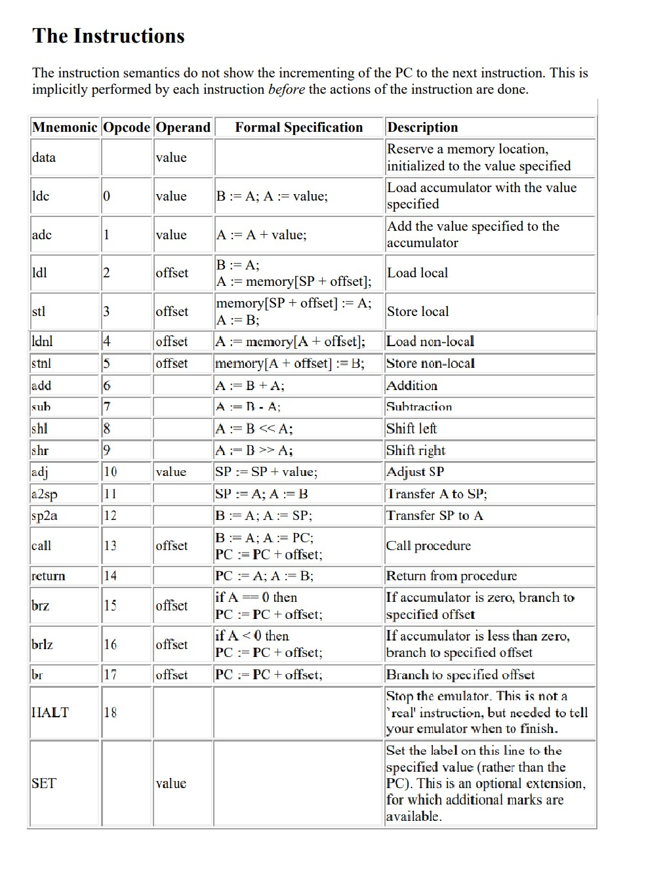

# CS2102_Project-2PassAssembler
SIMPLE Assembler and Emulator - A two-pass assembler and emulator for the SIMPLE assembly language, featuring label management, opcode translation, error diagnostics, and a virtual stack-based machine. Designed for executing custom assembly programs with basic arithmetic, branching, and stack operations.

---

## Table of Contents
- [Overview](#overview)
- [Assembler](#assembler)
  - [Pass 1](#pass-1)
  - [Pass 2](#pass-2)
- [Emulator](#emulator)
- [Features](#features)
- [Instruction Set](#instruction-set)
- [Proof](#proof)
- [Getting Started](#getting-started)
  - [Prerequisites](#prerequisites)
  - [Installation](#installation)


---

## Overview

This project is divided into two main components:
1. **2-Pass Assembler**: Converts assembly code into machine-readable code in two passes.
2. **Emulator**: Simulates the execution of machine code generated by the assembler.

## Assembler

The 2-pass assembler takes in assembly language code and performs the following steps:

### Pass 1
- **Identify Label and Instructions**: Reads through the assembly code, identifies all labels, and records their locations in a symbol table.
- **Error Checking**: Checks for syntax errors and undefined labels.

### Pass 2
- **Instruction Translation**: Converts instructions and operands into machine code using the symbol table.
- **Output Machine Code**: Generates a machine code file that can be loaded into the emulator.

## Emulator

The emulator loads and executes the machine code produced by the assembler. It simulates a basic CPU with registers, memory, and a program counter, allowing it to interpret and execute each instruction.

## Features
- **2-Pass Assembly Process**: Ensures labels and symbols are correctly identified and referenced.
- **Error Detection**: Detects syntax errors, undefined labels, and invalid instructions.
- **Instruction Set Support**: Supports a custom instruction set for basic arithmetic, memory access, and branching operations.
- **Memory Dump**: Allows for viewing memory state at any point during execution.

## Instruction Set


## Proof


## Getting Started

### Prerequisites
- A C++ compiler (supports C++11 or higher)
- Basic knowledge of assembly language and CPU architecture

### Installation
Clone the repository and navigate to the project directory:
```bash
git clone https://github.com/your-username/assembler-emulator.git
cd assembler-emulator
```
Compile the assembler and emulator using the provided Makefile:
```bash
g++ asm.cpp -o asm
g++ emu.cpp -o emu
```
Run the assembler and emulator using the following commands:
```bash
./asm <filename>.asm
./emu <filename>.o
```


